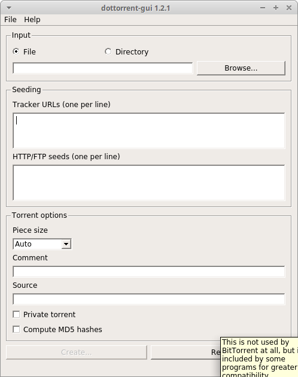

==============
dottorrent-gui
==============

An advanced GUI torrent file creator with batch functionality, powered by PyQt and
`dottorrent <https://github.com/kz26/dottorrent>`_

--------
Features
--------

* Fast (capable of several hundred MB/s)
* Cross-platform
* Full Unicode support
* Automatic and manual piece size selection, up to 64MB
* Batch torrent creation mode
* Filename exclusion patterns
* HTTP/web seeds support `(BEP 19) <http://www.bittorrent.org/beps/bep_0019.html>`_
* Private flag support `(BEP 27) <http://www.bittorrent.org/beps/bep_0027.html>`_
* User-definable source string
* Optional MD5 file hash inclusion
* Import/export of profiles (trackers, web seeds, source string, filename exclusion patterns)

------------
Installation
------------

Windows
-------

Binary releases of stable versions for 64-bit Windows can be found at
`https://github.com/kz26/dottorrent-gui/releases <https://github.com/kz26/dottorrent-gui/releases>`_.
Extract to a folder and run ``dottorrent_gui.exe``. You may need to download and install the `Microsoft Visual C++ Redistributable for Visual Studio 2015 <https://www.microsoft.com/en-us/download/details.aspx?id=48145>`_.

Linux and Mac OS X
-----

**Requirements**

* Python 3.3+
* PyQt5 5.7+

Latest stable release: ``pip install dottorrent-gui``

Development: ``git clone`` this repository, then ``pip install .``

To run: ``dottorrent-gui``

-------------
Portable Mode
-------------

dottorrent-gui can be configured to run in portable mode, good for running from USB drives and network shares.
To enable this, simply create an empty file named ``dottorrent-gui.ini`` in the same directory as the
main excecutable.

-------
License
-------

© 2017 Kevin Zhang. Made available under the terms of the
`GNU General Public License v3 <http://choosealicense.com/licenses/gpl-3.0/>`_.
